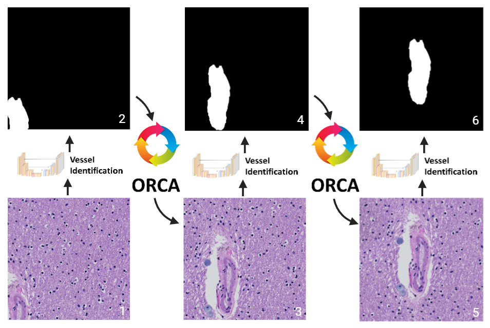

# ArtS and VasM

## *Applying Machine Learning to Assist in the Morphometric Assessment of Brain Arteriosclerosis Through Automation*

*Submitted to Free Neuropathology on March 16, 2025*

**[Journal Link Under Construction](***)** | **[Download Model](***)** | **[Citation Link Available Following Publication](***)**

**Abstract**:\
Objective quantification of brain arteriolosclerosis remains an area of ongoing refinement in neuropathology, with current methods primarily utilizing semi-quantitative scales completed through manual histological examination. These approaches offer modest inter-rater reliability and do not provide precise quantitative metrics. To address this gap, we present a prototype end-to-end machine learning (ML)-based algorithm – Arteriolosclerosis Segmentation (ArtS) followed by Vascular Morphometry (VasM) – that can assist neuropathologists in the morphometric analysis of arteriolosclerotic vessels on whole slide images (WSIs). We digitized hematoxylin and eosin-stained glass slides (13 participants, total 42 WSIs) of human brain frontal or occipital lobe cortical and/or periventricular white matter collected from three brain banks (UCD, UCI, and UCLA ADRCs). ArtS comprises three ML models for blood vessel detection, arteriolosclerosis classification, and segmentation of arteriolosclerotic vessel walls and lumens. For blood vessel detection, ArtS achieved area under the receiver operating characteristic curve (AUC-ROC) values of 0.79 (internal hold-out testing) and 0.77 (external testing), Dice scores of 0.56 (internal hold-out) and 0.74 (external), and Hausdorff distances of 2.53 (internal hold-out) and 2.15 (external). Arteriolosclerosis classification demonstrated accuracies of 0.94 (mean, 3-fold cross-validation), 0.86 (internal hold-out), and 0.77 (external), alongside AUC-ROC values of 0.69 (mean, 3-fold cross-validation), 0.87 (internal hold-out), and 0.83 (external). For arteriolosclerotic vessel segmentation, ArtS yielded Dice scores of 0.68 (mean, 3-fold cross-validation), 0.73 (internal hold-out), and 0.71 (external); Hausdorff distances of 7.63 (mean, 3-fold cross-validation), 6.93 (internal hold-out), and 7.80 (external); and AUC-ROC values of 0.90 (mean, 3-fold cross-validation), 0.92 (internal hold-out), and 0.87 (external). VasM successfully derived sclerotic indices, vessel wall thicknesses, and vessel wall to lumen area ratios from ArtS-segmented vessels, producing results comparable to expert assessment. This integrated approach shows promise as an assistive tool to enhance current neuropathological evaluation of brain arteriolosclerosis, offering potential for improved inter-rater reliability and quantification.

## What is ArtS and VasM?

Together, ArtS and VasM compose a prototype end-to-end ML-based pipeline that can assist neuropathologists in the morphometric analysis of arteriolosclerotic vessels on whole slide images. The ML component Arteriolosclerosis Segmentation (ArtS) receives WSIs as input and outputs segmentations of arteriolosclerotic blood vessel walls and lumens, which are in turn input into the non-ML component Vascular Morphometry (VasM) that outputs quantitative metrics for the sclerotic index, vessel wall thickness, and vessel wall to lumen area ratio.

**Why use ArtS and VasM?**  

> Objective quantification of brain arteriolosclerosis remains an area of ongoing refinement in neuropathology, with current methods primarily utilizing semi-quantitative scales completed through manual histological examination. These approaches offer modest inter-rater reliability and do not provide precise quantitative metrics. ArtS and VasM show promise as an assistive tool to enhance current neuropathological evaluation of brain arteriolosclerosis, offering potential for improved inter-rater reliability and quantification.

## Algorithm Architecture and Walkthrough

### Phase 1: Arteriolosclerosis Segmentation (ArtS)

ArtS comprises four algorithms that complete four sequential steps (Figure 2). After WSI tiling, the first step (Phase 1a) is to detect blood vessels and keep tiles that contain a blood vessel and discard those that do not. The second step (Phase 1b) is to recursively shift tiles until the detected blood vessel appears at the center of the tile. The third step (Phase 1c) is to keep tiles that contain a blood vessel with arteriolosclerosis and discard those that do not. The fourth step (Phase 1d) is to segment the walls and lumens of blood vessels with arteriolosclerosis.


**Figure 2:** The ML pipeline received WSIs of H&E-stained cortical and/or periventricular white matter brain tissue as input. Each WSI was tiled into tens of thousands of (512 x 512) pixel image tiles. (Phase 1a) The blood vessel detection ML model sorted tiles into those with blood vessels and those without. (Phase 1b) Object of interest Recursive Centering Algorithm (ORCA) generated new tiles centered onto the detected blood vessels. (Phase 1c) An arteriolosclerosis classification model separated tiles with centered blood vessels into those with arteriolosclerosis and those without. (Phase 1d) A modified Attention U-Net segmented the arteriolosclerotic vessel walls and lumens to produce the final output. All models within ArtS take advantage of fixed ImageNet pretrained parameters from Google’s EfficientV2L to extract low-level features prior to learning vessel specific features de-novo. 

<ins>Phase 1a:</ins> Blood vessel detection. The blood vessel detection neural network consisted of an Attention U-net architecture33 with an encoder composed of an EfficientNetV2L34 backbone with five semi-trainable convolution layers followed by two fully trainable convolution layers and a decoder composed of seven trainable convolution layers generated through the concatenation of a 2D transpose convolution of the prior layer and an attention gate33 that filters features propagated from the skip connections.

<u>Phase 1b:</u> Blood vessel centering. Blood vessel centering was achieved by a custom recursive algorithm – Object of interest Recursive Centering Algorithm (ORCA) – wrapping the blood vessel detection neural network (Figure 3). The wrapper algorithm inputs raw (512 x 512) tiles into the blood vessel detection neural network, which segments blood vessels. Subsequently the wrapper algorithm generates a new (512 x 512) tile with shifted boundaries such that the detected blood vessel resides closer to the center of the tile. This process is repeated until the detected blood vessel lies in the center of the final output tile (Figure 3). ORCA detects when the patch has been centered onto the blood vessel(s) by comparing the coordinates of the new patch with shifted boundaries to the original input patch; if the shift in boundaries is less than a preset threshold, then the patch is considered blood vessel(s) centered. The average runtime per WSI was approximately 37 minutes.


Figure 3: Object of interest Recursive Centering Algorithm (ORCA). Starting at step (1), the algorithm inputs a raw (512 x 512) image tile through the embedded blood vessel detection model which produces an output segmentation (2). (3) ORCA creates a new patch from the input WSI used modified shifted coordinates based on the previous segmentation. (4-6) Steps 1 through 3 are repeated until the vessel is centered. 

<u>Phase 1c:</u> Arteriolosclerosis classification. The arteriolosclerosis classification neural network consisted of an EfficientNetV2L34 backbone with five semi-trainable convolution layers topped by two fully trainable convolution layers, followed by three dense layers.

<u>Phase 1d:</u> Arteriolosclerotic vessel segmentation. The arteriolosclerotic vessel segmentation network used the same architecture as the model for blood vessel detection.


**Supplementary Figure 3:** Detailed architecture of the classification and segmentation ML models. “Conv2D” operations consisted of separable 2D convolutions with kernel size = (3, 3), stride = 1, and padding = 1 followed by batch normalization and Leaky ReLU. For subsampling, we utilized separable 2D convolutions with kernel size = (3, 3), stride = 2, and padding = 1. (a) The arteriolosclerosis classification model comprised an EfficientNetV2L34 backbone with five semi-trainable convolution layers followed by two fully trainable convolution layers and three dense fully connected layers. The semi-trainable Conv2D layers involved concatenating the subsampling of the previous layer and an EfficientNet2VL layer with frozen parameters followed by a “Conv2D” operation. The model contained 11 layers with 118,123,101 total parameters, 95,789,413 trainable parameters, and 22,333,688 untrainable parameters. (b) The blood vessel detection and arteriolosclerotic vessel segmentation models comprised an Attention U-net architecture33 with an encoder composed of an EfficientNetV2L34 backbone with five semi-trainable convolution layers followed by two fully trainable convolution layers and a decoder composed of seven trainable convolution layers generated by concatenating the 2D transpose convolution of the previous 

### Walkthrough

> **Note:** Replace all `#Insert path` placeholders with the appropriate file paths for your setup.

#### Step 1: Organize WSIs
Organize whole slide images (WSIs) intended for analysis into a folder.

WSIs used in this study are accessible via the below Zenodo records.

Links under construction.

#### Step 2: Patch Extraction with ORCA
Use `ORCA.py` to obtain patches centered on detected blood vessels.

Input WSIs into ORCA through fnames, the list of paths to your WSIs that ORCA will process.

```python
if __name__ == '__main__':
    # --- Autoselect GPU
    gpus.autoselect()

    fnames = [
        '#Insert paths to WSIs'
    ]
```

#### Step 3: Arteriolosclerosis Classification
Input patches centered onto detected blood vessels into the arteriosclerosis classification model `Unfrozen_EfficientNetV2L_v0.64` to separate patches with arteriolosclerotic blood vessels from those without.

*Set up the environment*
```python
import glob, numpy as np, pandas as pd, tensorflow as tf, os, scipy, random
from tensorflow.keras import Input, Model, layers

import sys
sys.path.append('#path to folder containing jerry_utils.py')
from jerry_utils import load_dataset_v1
```

*Load the model*
```python
name = 'Unfrozen_EfficientNetV2L_v0.64'
model_path = '#Insert path to model hdf5 file'
model = tf.keras.models.load_model(model_path)
```

*Load the dataset*
```python
input_path = glob.glob('#path to where you saved the blood vessel centered patches generated by ORCA')
input = load_dataset_v1(input_path)
```

*Run inference*
The prediction output of the arteriolosclerosis model is output as the variable `pred`.

- The  labels for the classification output are:
  - `0`: No arteriolosclerosis  
  - `1`: Arteriolosclerosis

```python
for x, y in external:
    logits = model.predict(x)
    m = np.argmax(logits, axis=-1)
    pred = tf.cast(np.squeeze(m), tf.uint8)
```

Save patches with and without arteriolosclerotic vessels into separate folders.

#### Step 4: Arteriolosclerotic Vessel Wall and Lumen Segmentation
Use `Attention_Unfrozen_EfficientNetV2L_data.test.v2_v0.7_try` to segment arteriosclerotic vessel walls and lumens.

*Set up the environment*
```python
import glob, numpy as np, pandas as pd, tensorflow as tf, os, scipy, random
from tensorflow.keras import Input, Model, layers
from scipy.spatial.distance import directed_hausdorff

import sys
sys.path.append('#path to folder containing jerry_utils.py')
from jerry_utils import load_dataset_v1
import jerry_losses, jerry_metrics
```

*Load the model*
```python
name = 'Attention_Unfrozen_EfficientNetV2L_data.test.v2_v0.7_try'
model_path = '#Insert path to model hdf5 file'

custom_objects = {
    'dice_all': jerry_metrics.dice_metric(cls=1),
    'hausdorff_all': jerry_metrics.hausdorff_metric(cls=1),
    'focal_dice_like_loss_multiclass_weighted': jerry_losses.focal_dice_like_loss_multiclass_weighted
}

model = tf.keras.models.load_model(model_path, custom_objects=custom_objects)
```

*Load the dataset*
```python
input_path = glob.glob('#path to where you saved the patches with arteriolosclerotic blood vessels')
input = load_dataset_v1(input_path)
```

*Run inference*
- The mask labels for the segmentation output are:
  - `0` for background  
  - `1` for vessel (both wall and lumen)  
  - `2` for vessel lumen only  

- The segmentation output is stored in the variable `pred`.
  
```python
for x, y in input:
    logits = model.predict(x)
    pred = np.argmax(logits, axis=-1)
```

Save each segmentation output into a specific folder for use in VasM.

## Phase 2: Vascular Morphometry (VasM)

For each arteriolosclerotic blood vessel analyzed, VasM outputs the sclerotic index, vessel wall thickness, and vessel wall to lumen area ratio, which have previously been used as an indicator of the degree of vascular stenosis. The final sclerotic index and vessel wall thickness outputs include the median, mean, standard deviation, minimum, and maximum of sclerotic indices and vessel wall thicknesses calculated in a 360-degree rotation around the center of the blood vessel lumen. We pilot test two methods for calculating blood vessel wall thickness: a radii-based method and a tangent line-based method. The tangent line-based method appears to generate metrics with greater proximity to human expert measurements, and so we only include this method here.

## Walkthrough

> **Note:** Replace all `#Insert path` placeholders with the appropriate file paths for your setup.

### Step 1: Load segmented vessels
```python
path = '#path to ArtS-segmented arteriolosclerotic vessels'
test = tf.data.Dataset.load(path)
```

### Step 2: Change save path for VasM output
```python
df = pd.DataFrame(metrics_dict)
df.to_csv('#save_path.csv', index=False)
```

### Step 3: Run VasM

