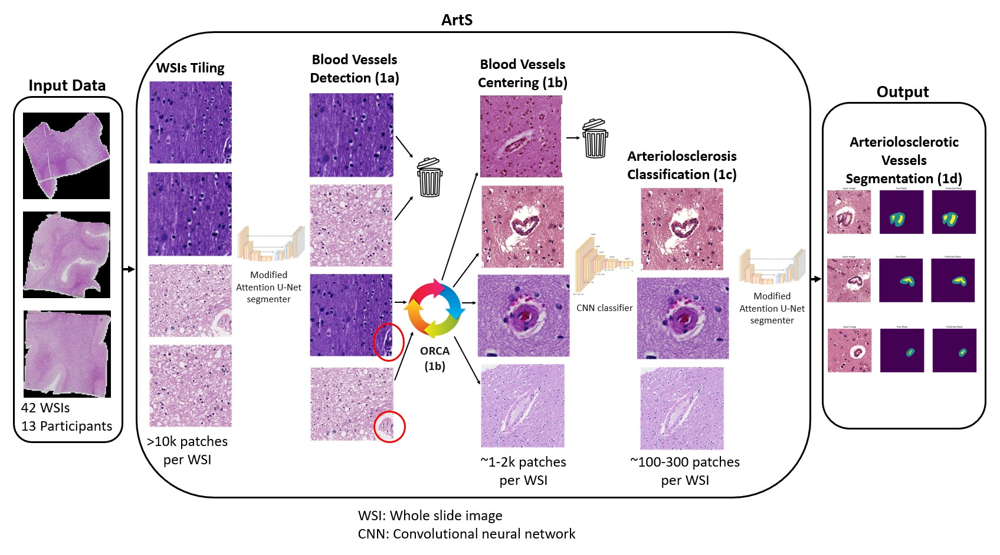

# ArtS and VasM

## *Applying Machine Learning to Assist in the Morphometric Assessment of Brain Arteriosclerosis Through Automation*

*Submitted to Free Neuropathology on March 16, 2025*

**[Journal Link Under Construction](***)** | **[Download Model](***)** | **[Citation Link Available Following Publication](***)**

**Abstract**:\
Objective quantification of brain arteriolosclerosis remains an area of ongoing refinement in neuropathology, with current methods primarily utilizing semi-quantitative scales completed through manual histological examination. These approaches offer modest inter-rater reliability and do not provide precise quantitative metrics. To address this gap, we present a prototype end-to-end machine learning (ML)-based algorithm – Arteriolosclerosis Segmentation (ArtS) followed by Vascular Morphometry (VasM) – that can assist neuropathologists in the morphometric analysis of arteriolosclerotic vessels on whole slide images (WSIs). We digitized hematoxylin and eosin-stained glass slides (13 participants, total 42 WSIs) of human brain frontal or occipital lobe cortical and/or periventricular white matter collected from three brain banks (UCD, UCI, and UCLA ADRCs). ArtS comprises three ML models for blood vessel detection, arteriolosclerosis classification, and segmentation of arteriolosclerotic vessel walls and lumens. For blood vessel detection, ArtS achieved area under the receiver operating characteristic curve (AUC-ROC) values of 0.79 (internal hold-out testing) and 0.77 (external testing), Dice scores of 0.56 (internal hold-out) and 0.74 (external), and Hausdorff distances of 2.53 (internal hold-out) and 2.15 (external). Arteriolosclerosis classification demonstrated accuracies of 0.94 (mean, 3-fold cross-validation), 0.86 (internal hold-out), and 0.77 (external), alongside AUC-ROC values of 0.69 (mean, 3-fold cross-validation), 0.87 (internal hold-out), and 0.83 (external). For arteriolosclerotic vessel segmentation, ArtS yielded Dice scores of 0.68 (mean, 3-fold cross-validation), 0.73 (internal hold-out), and 0.71 (external); Hausdorff distances of 7.63 (mean, 3-fold cross-validation), 6.93 (internal hold-out), and 7.80 (external); and AUC-ROC values of 0.90 (mean, 3-fold cross-validation), 0.92 (internal hold-out), and 0.87 (external). VasM successfully derived sclerotic indices, vessel wall thicknesses, and vessel wall to lumen area ratios from ArtS-segmented vessels, producing results comparable to expert assessment. This integrated approach shows promise as an assistive tool to enhance current neuropathological evaluation of brain arteriolosclerosis, offering potential for improved inter-rater reliability and quantification.

## What is ArtS and VasM?

Together, ArtS and VasM compose a prototype end-to-end ML-based pipeline that can assist neuropathologists in the morphometric analysis of arteriolosclerotic vessels on whole slide images. The ML component Arteriolosclerosis Segmentation (ArtS) receives WSIs as input and outputs segmentations of arteriolosclerotic blood vessel walls and lumens, which are in turn input into the non-ML component Vascular Morphometry (VasM) that outputs quantitative metrics for the sclerotic index, vessel wall thickness, and vessel wall to lumen area ratio.

**Why use ArtS and VasM?**  

> Objective quantification of brain arteriolosclerosis remains an area of ongoing refinement in neuropathology, with current methods primarily utilizing semi-quantitative scales completed through manual histological examination. These approaches offer modest inter-rater reliability and do not provide precise quantitative metrics. ArtS and VasM show promise as an assistive tool to enhance current neuropathological evaluation of brain arteriolosclerosis, offering potential for improved inter-rater reliability and quantification.

## Algorithm Architecture  

ArtS comprises four algorithms that complete four sequential steps (Figure 2). After WSI tiling, the first step (Phase 1a) is to detect blood vessels and keep tiles that contain a blood vessel and discard those that do not. The second step (Phase 1b) is to recursively shift tiles until the detected blood vessel appears at the center of the tile. The third step (Phase 1c) is to keep tiles that contain a blood vessel with arteriolosclerosis and discard those that do not. The fourth step (Phase 1d) is to segment the walls and lumens of blood vessels with arteriolosclerosis.

**Figure 2:** The ML pipeline received WSIs of H&E-stained cortical and/or periventricular white matter brain tissue as input. Each WSI was tiled into tens of thousands of (512 x 512) pixel image tiles. (Phase 1a) The blood vessel detection ML model sorted tiles into those with blood vessels and those without. (Phase 1b) Object of interest Recursive Centering Algorithm (ORCA) generated new tiles centered onto the detected blood vessels. (Phase 1c) An arteriolosclerosis classification model separated tiles with centered blood vessels into those with arteriolosclerosis and those without. (Phase 1d) A modified Attention U-Net segmented the arteriolosclerotic vessel walls and lumens to produce the final output. All models within ArtS take advantage of fixed ImageNet pretrained parameters from Google’s EfficientV2L to extract low-level features prior to learning vessel specific features de-novo. 

